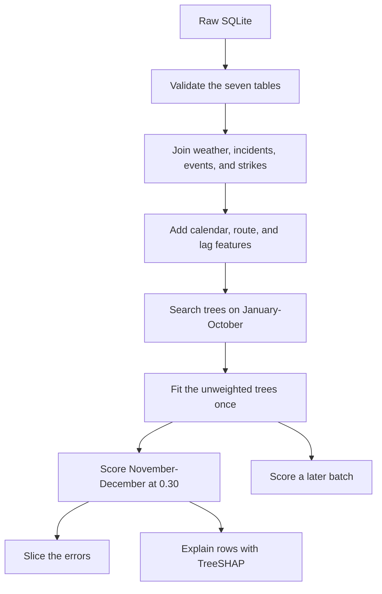

# Transit disruption prediction

**Synthetic data.** The Berlin S-Bahn punctuality records used in this project are synthetic. They are not official S-Bahn Berlin or Deutsche Bahn operational data. Delays, cancellations, incidents, weather, events, and strikes in this dataset do not describe real service. Do not use results from this project to judge actual punctuality or to make operational decisions.

## Problem

A trip is delayed when `delay_minutes` is 6 or more. About 3% of the remaining trips meet that rule, so a model that always says "on time" is right about 97% of the time and still misses every delay. The useful question is whether a trip can be called delayed from information that would already be known before `scheduled_departure_time`.

The shipped answer is a yes/no call. The model estimates the probability of delay. A trip is called delayed when that probability is at least 0.30. That cutoff was chosen on January–October only. November–December is the holdout.

## Data

Source: [Berlin S-Bahn Punctuality Database](https://www.kaggle.com/datasets/alperenmyung/berlin-s-bahn-punctuality-database) (`alperenmyung/berlin-s-bahn-punctuality-database`). Counts below come from the SQLite file, checked in `notebooks/01_eda.ipynb`. Table checks are in `docs/data_quality.md`. The column rules are in `docs/feature_dictionary.md`.

- 131,771 trips, from 2024-01-01 through 2024-12-30. 2024-12-31 has no trips.
- 860 trips (0.65%) are cancelled. They are dropped before modeling, so `is_cancelled` is a row filter. After that filter, 126,968 trips are on time and 3,943 are delayed (about 32 to 1).
- `delay_minutes` has a long tail past an hour. The EDA histogram uses `log1p(delay_minutes)`.
- Disruption tables are small: 36 incidents, 3 city events, and 3 strikes, all inside the trip calendar. June has no incidents. An event-day feature rests on three dates.

Weather, incidents, events, and strikes are joined onto each trip only when they would already apply at departure: the weather hour is the floored departure hour, an incident covers the next 60 minutes on the same line, an event must name the line on that calendar date, and a strike is the half-open window from start to end.

## Approach



January–October (109,485 trips) is the development block. A 5-fold `TimeSeriesSplit` walks forward through it. Rows that share a boundary timestamp stay in training, so every validation departure is strictly later. Optuna ran 40 trials and scored each trial at probability 0.50. November and December were not part of any trial.

The shipped classifier is the unweighted tree set in `reports/optuna/baseline_params.json`. It is fit once on January–October and scored once on November–December (21,426 trips). The operating cutoff, 0.30, is the delayed-class F1 peak on pooled out-of-fold predictions from January–October. The full account is in `docs/model_card.md`. The plots are in `notebooks/03_evaluation.ipynb`.

Leakage columns stay off the model: the delay label, `delay_minutes`, cancellation, the trip id, and the two delay proxies. `scheduled_departure_time` and the station and line names are also excluded. Lags use only earlier departures.

## Results

At 0.30 the holdout confusion matrix is 20,380 true on-time, 162 false alarms, 91 missed delays, and 793 caught delays.

| Quantity | Value |
|---|---:|
| Development trips | 109,485 |
| Holdout trips | 21,426 |
| True on time | 20,380 |
| False alarms | 162 |
| Missed delays | 91 |
| Caught delays | 793 |
| Delayed-class F1 | 0.862 |
| 95% interval for that F1 | 0.844 to 0.879 |
| On-time recall | 0.992 |
| Delayed recall | 0.897 |

The interval resamples the 21,426 scored holdout rows 1,000 times and leaves the trees as they are. It is stored in `reports/evaluation/uncertainty.json`.

`reports/evaluation/test_metrics.json` scores the same trees at the search cutoff of 0.50. That file also reports a separate regression model: the same tree settings, without `scale_pos_weight`, predicting `delay_minutes`.

| Quantity | Value |
|---|---:|
| Delayed-class F1 at 0.50 | 0.874 |
| Macro-F1 at 0.50 | 0.934 |
| On-time recall at 0.50 | 0.995 |
| Delayed recall at 0.50 | 0.863 |
| MAE, minute model | 1.65 minutes |
| RMSE, minute model | 10.83 minutes |

RMSE is much larger than MAE because a few large misses, likely the strike-day delays, are squared and dominate the average. Most trips are predicted within a minute or two. Slices, the 0.30 cutoff, and TreeSHAP cover the classifier. They do not cover the minute model.

Ordinary days, with no strike, incident, or event, have delayed-class F1 0.717 and hold 126 of the 162 false alarms and 86 of the 91 misses. Strike days (565 trips, 93.6% delayed) have F1 0.962.

| Slice | Trips | Delay rate | Precision | Recall | F1 | False alarms | Missed delays |
|---|---:|---:|---:|---:|---:|---:|---:|
| Ordinary day | 20,853 | 1.7% | 0.681 | 0.758 | 0.717 | 126 | 86 |
| Strike | 565 | 93.6% | 0.936 | 0.991 | 0.962 | 36 | 5 |
| Incident | 8 | 0% | 0.000 | 0.000 | 0.000 | 0 | 0 |
| Event | 0 | — | — | — | — | 0 | 0 |

S41 and S42 together account for 83 false alarms and 60 missed delays. The weakest hours are 08:00 (F1 0.707) and 16:00 (F1 0.703). Heavy rain, above 2 mm, holds 55 of the 91 missed delays. The event-day slice has no November–December trips, and the 8 incident trips were all on time.

TreeSHAP on those same rows starts from an expected log-odds of −6.77, about a 0.1% chance of delay, so a trip needs a large positive push to reach probability 0.30. The largest mean absolute contributions are the previous hour's mean delay on the line (0.426), weather condition (0.373), route (0.330), and the previous day's mean delay (0.259). The four trips closest to 0.30 are in `reports/evaluation/shap_cases.json`.

## How to run

Python 3.12. From the repository root:

```powershell
python -m venv .venv
.\.venv\Scripts\Activate.ps1
pip install -e ".[dev,notebooks]"
```

The Kaggle files are not committed. Download them and copy the extract into `data/raw/`:

```powershell
python -c "import kagglehub; print(kagglehub.dataset_download('alperenmyung/berlin-s-bahn-punctuality-database'))"
Copy-Item "$env:USERPROFILE\.cache\kagglehub\datasets\alperenmyung\berlin-s-bahn-punctuality-database\versions\2\*" data\raw\
```

`sbahn.config.database_path()` uses `data/raw/berlin_sbahn_delays.db` when that file is present, and otherwise the kagglehub cache.

Build the tables, fit and score the shipped model, then slice and explain the holdout:

```powershell
python -m sbahn.data.interim
python -m sbahn.data.build_dataset --raw-dir data/raw --out data/interim/trips_merged.parquet
python -m sbahn.features.build --in data/interim/trips_merged.parquet --out data/processed/trips_features.parquet
python -m sbahn.models.evaluate
python -m sbahn.models.slices
python -m sbahn.models.shap_explain
```

Score a later batch from an engineered parquet. The file must include the January–October rows, because the trees are fit from those rows on each run. Departures before the cutoff are training rows and are omitted from the output.

```powershell
python -m sbahn.predict --input data/processed/trips_features.parquet --output reports/evaluation/batch_predictions.parquet
```

The same steps are targets in the `Makefile` (`interim`, `data`, `features`, `evaluate`, `slices`, `shap`, `predict`). `make pipeline` runs those stages and also `make train`. `make train` is the 40-trial search. It writes `reports/optuna/best_params.json`. The shipped model stays the unweighted file `reports/optuna/baseline_params.json`. `make evaluate` reads that baseline file.

Docker runs the evaluation path from the saved baseline. Mount the SQLite directory read-only:

```powershell
docker build -t sbahn .
docker run --rm -v "$env:USERPROFILE\.cache\kagglehub\datasets\alperenmyung\berlin-s-bahn-punctuality-database\versions\2:/app/data/raw:ro" sbahn
```

Tests and lint:

```powershell
python -m pytest
python -m ruff check .
```

GitHub Actions (`.github/workflows/ci.yml`) runs that lint and the tests on every push and pull request.

Tuning runs are written to a local MLflow store at `mlruns/mlflow.db` (not committed). Record the studies already saved under `reports/optuna/`, then open the UI:

```powershell
python -m sbahn.models.tracking
mlflow ui --backend-store-uri sqlite:///mlruns/mlflow.db
```

```
data/raw/          Kaggle files, not committed
data/interim/      validated Parquet
data/processed/    model-ready feature tables
notebooks/         01_eda, 02_features, 03_evaluation
src/sbahn/         loading, features, models, predict
tests/             joins, leakage, splits, scoring
docs/              data quality, feature dictionary, model card
reports/           evaluation tables and figures
```

## Limitations

These scores describe one synthetic year. The holdout delayed-class F1 of 0.862 is lifted by strike days, when 93.6% of trips are delayed. On ordinary days the same rule scores 0.717.

The disruption tables cannot support a stable event or incident claim. The event slice has no November–December trips. The incident slice has 8 trips, all on time. Three strikes sit in the whole year, and two of them fall in January–October.

S41 and S42 hold most of the false alarms and missed delays. Hours 08:00 and 16:00 are the weakest. Heavy rain holds 55 of the 91 misses. The model starts from an expected log-odds of −6.77, so most trips stay near a zero probability of delay until a rare flag, recent delay, or weather condition pushes them up.

The minute model is a side score in `test_metrics.json`. It was not tuned, sliced, or explained. The 0.50 numbers in that file are the search cutoff. The operating call is 0.30.

There is no saved model file. Batch scoring refits the baseline trees on the pre-cutoff rows of the input table. A file that starts in November has nothing to fit.

## Next steps with real data

Replace the synthetic file with an official feed under a data agreement, and drop any field only known after departure (live delay, an outcome-based arrival prediction, a propensity score fit on the same trips).

Keep the same discipline: time split, cutoff chosen on an earlier window and scored once on a later one, ordinary days reported separately from strike/disruption days, slices and SHAP re-run on the new holdout.

Re-fit from scratch — the 0.30 cutoff and tree settings here describe the synthetic data only — and recheck calibration, the ring lines, and the commute hours before using it operationally.
